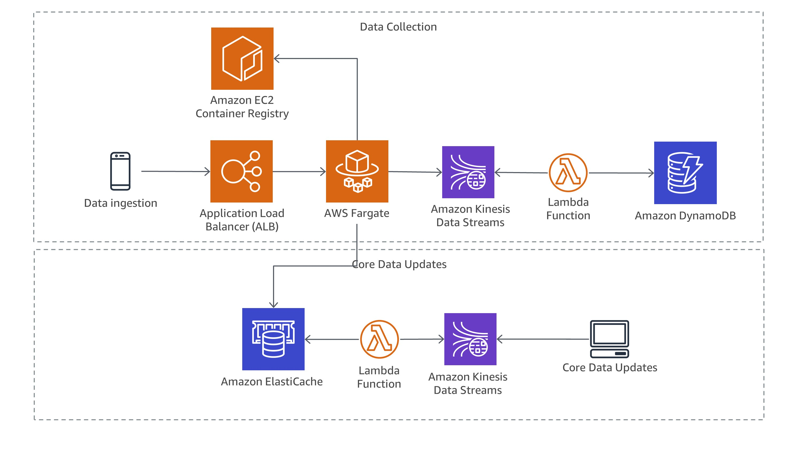

# Reactive Microservices Architectures with Amazon ECS, AWS Fargate, AWS Lambda, Amazon Kinesis Data Streams, Amazon ElastiCache, and Amazon DynamoDB

This reference architecture provides an Amazon CDK application for deploying a reactive microservices architecture based on [Amazon Elastic Container Service (Amazon ECS)](http://docs.aws.amazon.com/AmazonECS/latest/developerguide/Welcome.html) using [AWS Fargate](https://aws.amazon.com/fargate/), [AWS Lambda](https://aws.amazon.com/lambda/), [Amazon Kinesis Data Streams](https://aws.amazon.com/kinesis/streams/), [Amazon ElastiCache](https://aws.amazon.com/elasticache/), and [Amazon DynamoDB](https://aws.amazon.com/dynamodb/).

# Overview



The repository consists of a set of nested templates that deploy the following:

 - A tiered [VPC](http://docs.aws.amazon.com/AmazonVPC/latest/UserGuide/VPC_Introduction.html) with public and private subnets, spanning an AWS region.
 - A highly available Amazon ECS cluster with AWS Fargate.
 - One microservice deployed as [ECS service](http://docs.aws.amazon.com/AmazonECS/latest/developerguide/ecs_services.html) implementing the base logic for an ad-tracking solution leveraging the Kubernetes Native Java stack [Quarkus](https://quarkus.io/).
 - An [Application Load Balancer (ALB)](https://aws.amazon.com/elasticloadbalancing/applicationloadbalancer/) to the public subnets to handle inbound traffic.
 - ALB path-based routing for the ECS service to route the inbound traffic to the correct service.
 - Centralized container logging with [Amazon CloudWatch Logs](http://docs.aws.amazon.com/AmazonCloudWatch/latest/logs/WhatIsCloudWatchLogs.html).
 - Two [AWS Lambda](https://aws.amazon.com/lambda/)-functions to consume data from [Amazon Kinesis Streams](https://aws.amazon.com/kinesis/streams/) to process and store data.
 - Two [Amazon Kinesis Streams](https://aws.amazon.com/kinesis/streams/) to decouple microservies from each other.
 - A highly available [Amazon ElastiCache](https://aws.amazon.com/elasticache/)-cluster (Redis 7) deployed across two [Availability Zones](http://docs.aws.amazon.com/AWSEC2/latest/UserGuide/using-regions-availability-zones.html) in a [Replication Group with automatic failover](https://docs.aws.amazon.com/AmazonElastiCache/latest/UserGuide/AutoFailover.html). Redis is used as central data store and pub/sub messaging implementation.
 - An [Amazon DynamoDB](https://aws.amazon.com/dynamodb/)-table to persist event-data.

# Deployment

## Compile and upload Lambda functions

1. Compile the Kinesis-consumer Lambda function 
```
cd services/kinesis-consumer
cargo lambda build --release --target x86_64-unknown-linux-musl --output-format zip   
mv target/lambda/kinesis-consumer-lambda/bootstrap.zip target/lambda/kinesis-consumer-lambda/kinesis-consumer.zip
cd ..
```
2. Upload the `kinesis-consumer.zip`-file to <your-preferred-S3-bucket>

1. Compile the Redis-update Lambda function 
```
cd services/redis-updater 
cargo lambda build --release --target x86_64-unknown-linux-musl --output-format zip   
mv target/lambda/redis-updater/bootstrap.zip target/lambda/redis-updater/redis-updater.zip
cd ..
```
2. Upload the `redis-updater.zip`-file to <your-preferred-S3-bucket>

## Build Java app and container image

```
cd services/tracking-service/reactive-quarkus
docker build -t <your-container-image> -f src/main/docker/Dockerfile.jvm .
docker push <your-container-image>
```

## Deploy CDK app

```
cd infrastructure/reactive-cdk-app 
cdk bootstrap
cdk synth
cdk deploy --parameters containerImage=<your-container-image> --parameters s3Bucket=<your-preferred-S3-bucket>
```

# Test the application

After the application has been deployed correctly, you can load test data into Redis by calling the following URL using e.g. curl:

```
curl http://<endpoint>/cache/fill
```

After the cache has been filled succesfully, you can call the tracking application with an existing program id e.g. 212313

```
curl http://<endpoint>/event/212313
```

This HTTP call returns a response like

```
{"userAgent":"curl/7.54.0","programId":"212313","programName":"program2","checksum":"124","customerId":9124,"customerName":"Customer2","messageId":"06bc2944-886c-4e56-907c-fa248c8af023","valid":true"}
```

# Contributing

Please [create a new GitHub issue](https://github.com/awslabs/ecs-refarch-cloudformation/issues/new) for any feature requests, bugs, or documentation improvements. 

Where possible, please also [submit a pull request](https://help.github.com/articles/creating-a-pull-request-from-a-fork/) for the change.

